# SelfSustainingPlantPot
This project is an attempt at making a self watering plant pot that can water plants overtime with custom settings

Goals:
- enough water to last a week
- supplied by battery power
- release water consistently
bonus goals:
- controlled through web server
- setting for watering seeds over time

I wanted to start with a pot that contains the soil and the electronic components, which could have an external silo attached that could be filled with water. The pot diameter has to be at least 15 cm and the height must be 15cm in order for proper root development. With this in mind, a rough sketch can be made.

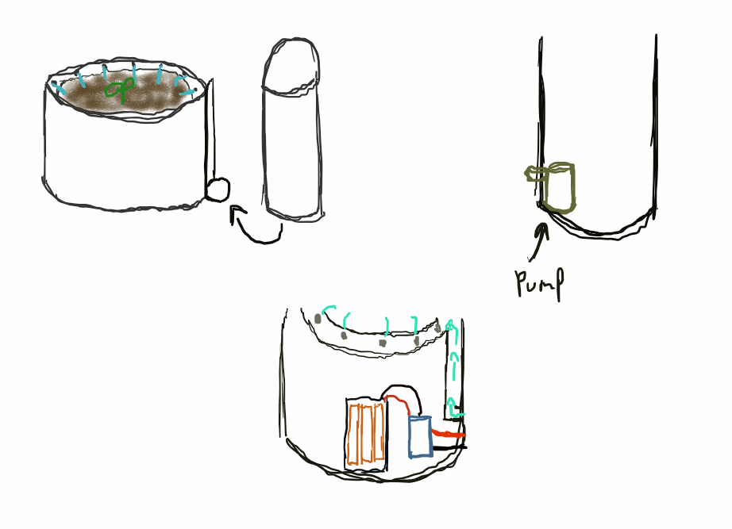

## Piping

The first step was to find out how the water pipe setup would be done. In order to do this i started by testing different pipe hole diameters, number of holes and pipe lengths until I found the desired pressure.

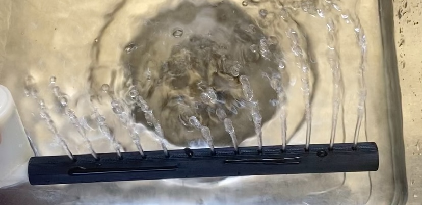

After some trial and error, the number of holes and diameter were determined and made into a ring.

Adding an extension pipe from the pump to the ring reduces the amount of pressure in the piping, so I assumed I would need to alter the ring's hole's size but the pressure was sustainable enough to travel the distance and exit the holes perfectly.
(This one was a bit over the top.)

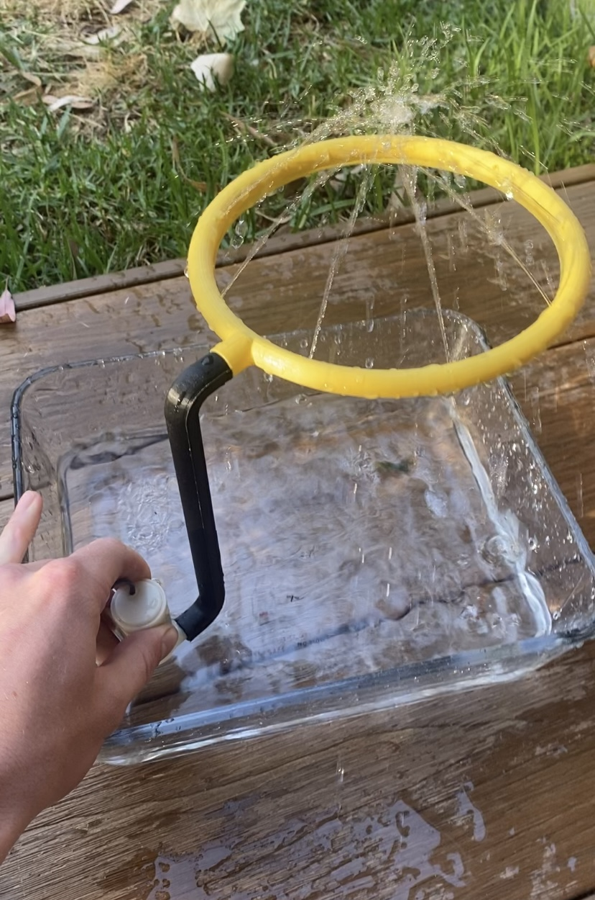

## Electronics
The electronics involved would have to be a power supply, a microcontroller and a small water pump. For the microcontroller, I chose the ESP32-c3 supermini for its size and web hosting capabilities. 

The power supply for the ESP32 needed a minimum of 3.3V and had to last a long period of time. With the ESP consuming 0.4 mA per hour at most in deep sleep and the estimated time for a lettuce to mature being at most 11 weeks (77 days, 1,848 hours), then the power supply needs 0.004 * 1,848 = 7392 mAh

Using a configuration of 3 AA batteries in series the collective voltage is 4.5V and has a current supply of 8,100mah satisfying the needs of the system

Starting out I used a transistor to deliver 5V to the pump through the board. This setup didn't work due to the poor flow of current through the resistor limiting the output of the water pump.

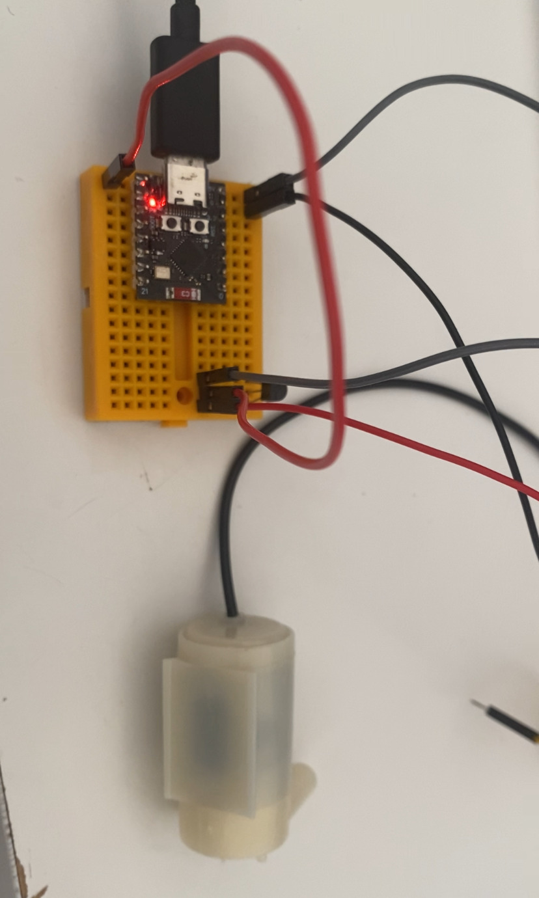

In order to fix this issue, I swapped the transistor for a relay with an external power supply. This solution also solved the voltage drop the ESP was suffering from, which caused it to reset every time the motor turned on.

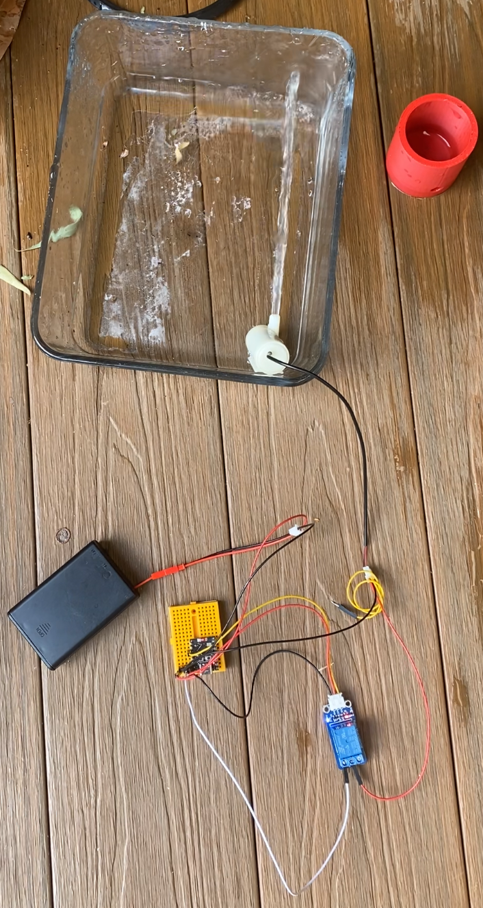

## Programming

In order to interact with the system, I used the ESPAsyncWebServer library, which allowed for the ESP to run an asynchronous web server off its wifi. This wifi can be connected with through any device in order to open a webpage containing the user interface of the system.

This user interface consists of a water setting for default watering a plant daily with the same amount aswell as a seed setting the takes a minimum and maximum amount of water as well as the amount of days to water in order to grow seeds. The seeds are watered exponentially over the day's as in the early stage of development the seeds need a small amount of water, and in the mature stages require a drastically larger amount of water.

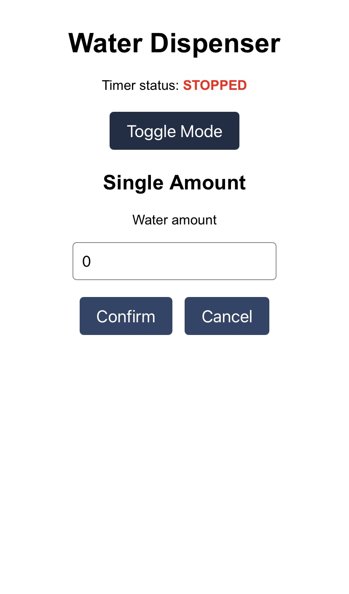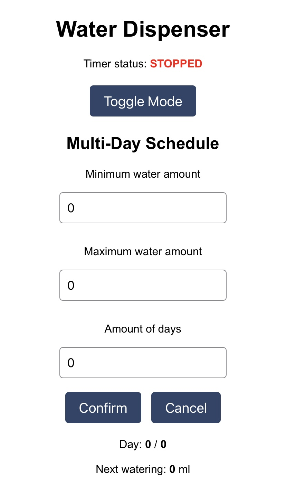

Deep sleep is an ultralow power state for microcontrollers that maximizes the amount of battery life when waiting. For the pot, the deep sleep is set once the watering settings are set and the switch for pin 5 is off. This turns off the wifi and other components and sets a 24hr timer for the system to wake up, water, sleep and repeat. With this programming running in the startup script of the esp the system can save power and extend the project's lifetime.

## Testing pot
A small lettuce needs roughly less than 1 cup of water a day for growth. With this in mind, the height of the reservoir can be calculated.

1 cup = 250ml, 7 cups = 1750ml, 1750ml = 1750cm^3, cylinder volume = pi*r^2*h, 1750cm = pi * 7.5^2 * h, h = 9.9cm

With this, the height of the reservoir will be rounded to 10 cm.

I wanted the pot to be modular in order to print in the printer's base of 256x256mm. In order to do this, I split the pipe, ring, reservoir, pot, and electrical components into seperate moduals.

## TEST POT

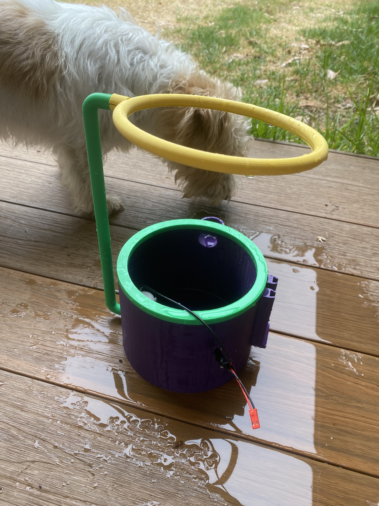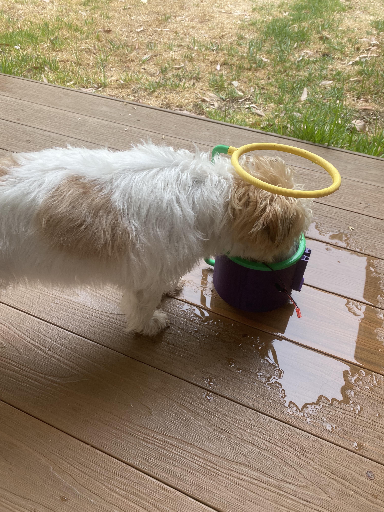

## FINAL MODELS

## Ring + Pipe
The ring connects into the top of the pot to keep it still, with the pipe having connections to the reservoir and ring.

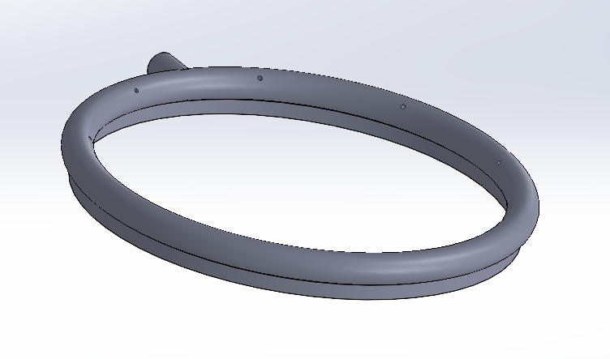
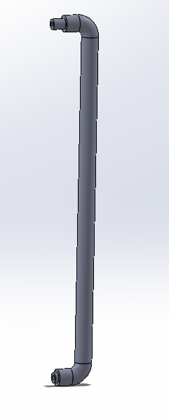

## Top Pot
The top pot has a custom screw base as well as a circular cut in the top to allow for a stable ring connection.

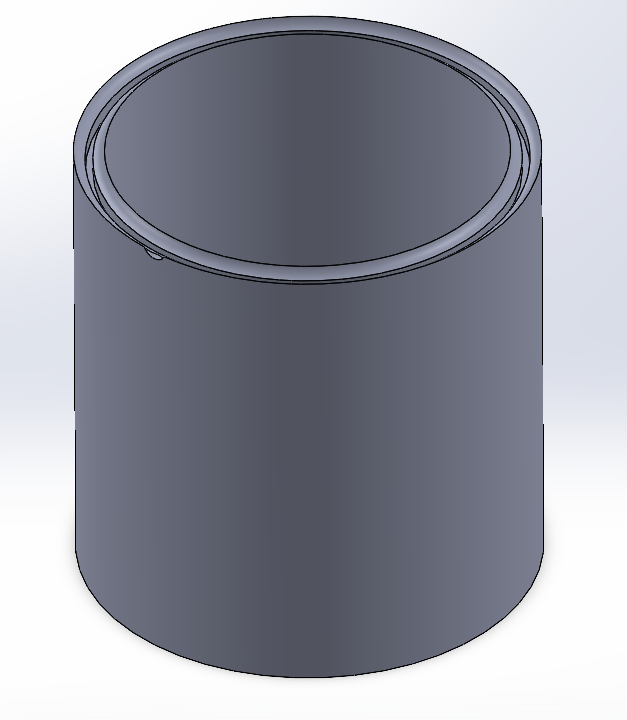

## Reservoir
The reservoir has the connection to the battery box to slide into as well as a hole for the pump's pipe to slot into.

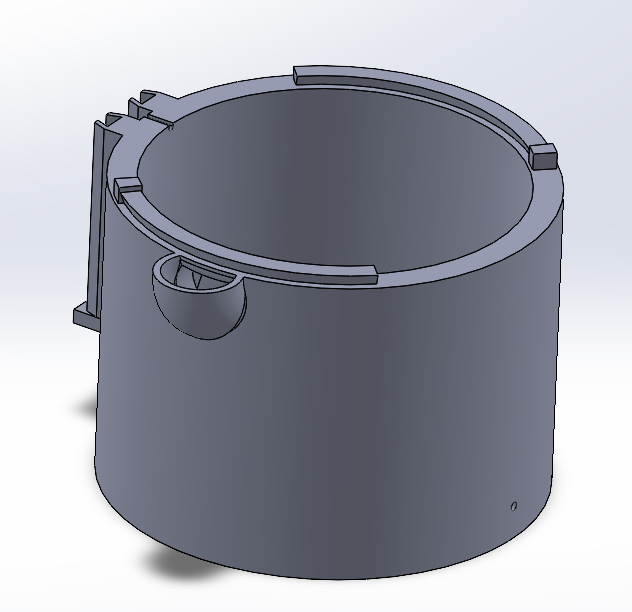

## Battery Box
The battery box is built of several parts that slide into place with each other before slotting into the reservoir. The battery box has space to hold 6 double A batteries, with the circuit box attaching on top for all the electrical components to sit inside.

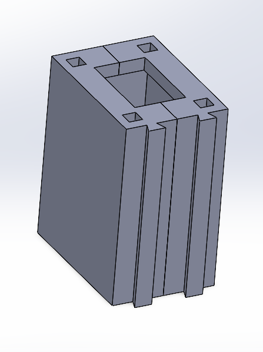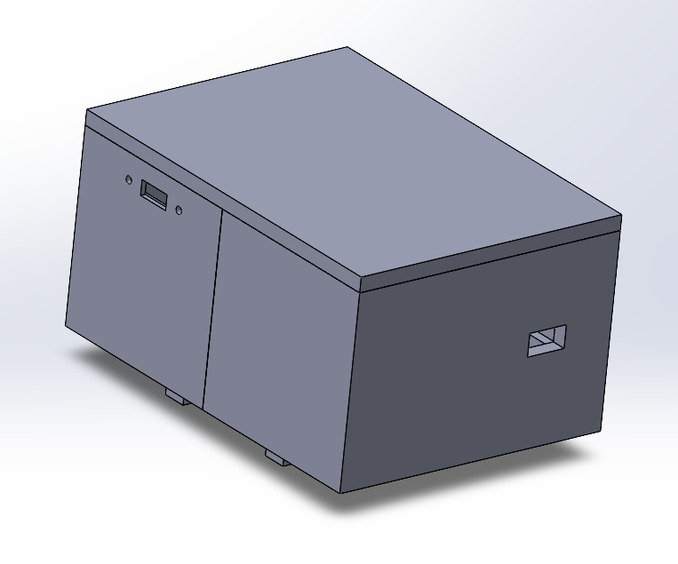

## FINISHED

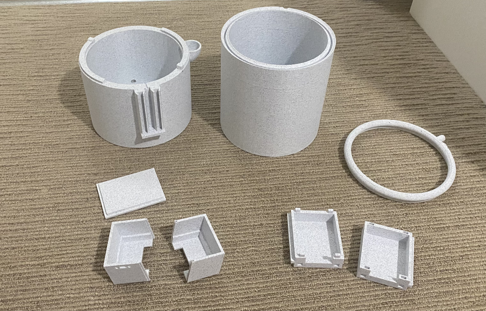

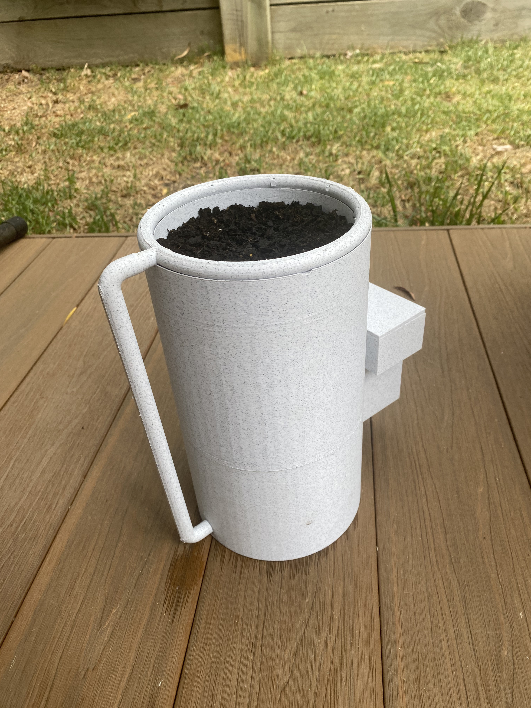

# Conclusion

Goals:
- enough water to last a week ✅
- supplied by battery power ✅
- release water consistently ✅
Bonus goals:
- controlled through web server ✅
- setting for watering seeds over time ✅

# mistakes/problems on the way
- SolidWorks saving files in order incorrectly (couldn't reprint pot)
- the external pipe leaks
- battery box clips separated (need to learn better techniques)

# Improvements for Next Time:
- reduce locking seal length (friction is very strong).
- get external clock from the esp as the esp couldn't track how longs it's slept for.
- improve seals for water pipes.
- Incorporate pipe into waterpot for better aesthetic.
- Create a custom PCB to reduce soldering errors.
  
I'll update this page with the lettuce growth once complete (if ever).

THANKS FOR READING!
